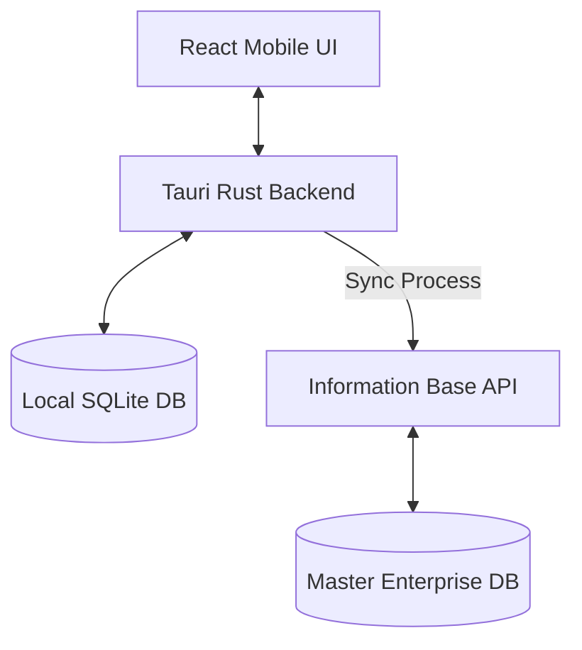

# System Architecture

## Core Pattern: Offline-First Hybrid App
The application leverages an offline-first architecture running on the **Tauri v2** framework. It bridges a modern web frontend with native device capabilities and a local database, ensuring 100% functionality without internet access.

## High-Level Components

### 1. Presentation Layer (Frontend)
- **Framework:** React 19 + TypeScript + Vite.
- **Responsibility:** Rendering the UI, capturing user input for Quality Control forms, and displaying sync statuses.

### 2. Bridge Layer (Tauri Core)
- **Framework:** Tauri v2 (Rust).
- **Responsibility:** Securely brokering communication between the React frontend and native system resources (file system, local database, Android intents).

### 3. Data Persistence Layer (Local)
- **Database:** Local SQLite database embedded within the application.
- **Responsibility:** Acting as the single source of truth while offline. All templates and un-synced drafts reside here.

### 4. Enterprise Integration Layer (Remote)
- **Endpoint:** Remote Information Base API (e.g., REST/GraphQL).
- **Responsibility:** Distributing predefined QC templates and receiving aggregated, completed inspection reports.

## System Diagram

