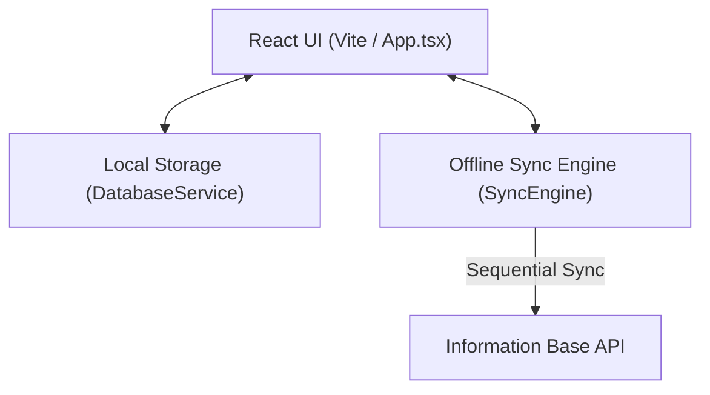

# System Architecture

## Core Pattern: Offline-First Hybrid App
The application leverages an offline-first architecture running on the **Tauri v2** framework. It uses a modern web frontend with secure localStorage persistence to ensure 100% functionality even without internet access.

## High-Level Components

### 1. Presentation & Controller Layer (Frontend)
- **Framework:** React 19 + TypeScript + Vite.
- **Responsibility:** Rendering the high-fidelity bento user interface, capturing operator inputs for Fabric & Packaging quality control forms, and managing conversational commands through the **Kaizen AI Assistant**.

### 2. Bridge Layer (Tauri Core)
- **Framework:** Tauri v2 (Rust).
- **Responsibility:** Securely brokering desktop window operations (minimize, close, maximize) for the frontend web application.

### 3. Data Persistence Layer (Local)
- **Database:** Local storage persistence engine (`DatabaseService`).
- **Responsibility:** Seeded with default inspection templates (`fabric_v1`, `pack_v2`). All newly created draft inspection reports are saved immediately to local storage before synchronization.

### 4. Enterprise Integration Layer (Remote)
- **Endpoint:** Remote Information Base API.
- **Responsibility:** Receives finalized inspection reports sequentially whenever connectivity is active via the active background listener.

## System Diagram

