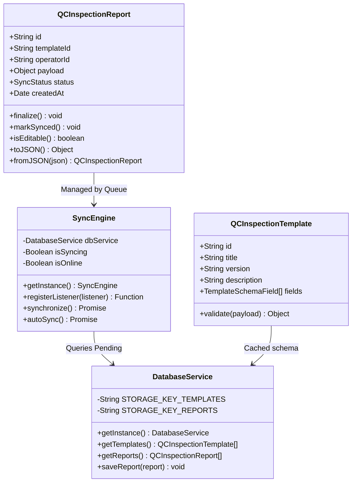
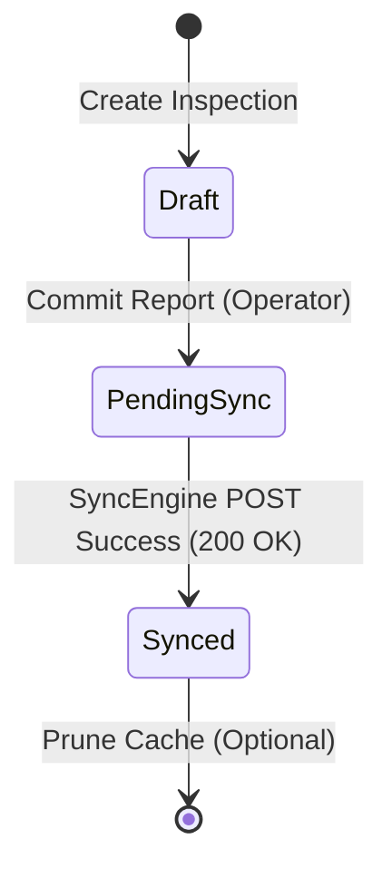

# Chimera QC Console // Quality Control Core
## Quality Control System (QCS) Offline Console

Welcome to the **Chimera QC Console**—a state-of-the-art, high-fidelity offline-first enterprise quality control application designed using robust **Object-Oriented Programming (OOP)** patterns.

The console enables remote field engineers and line operators to run mission-critical quality control inspections inside an offline environment (running under the **Tauri v2** desktop shell framework), automatically caching inspection reports locally using secure local storage and synchronizing them sequentially to the master enterprise network whenever connection is restored.

---

## 1. Object-Oriented Domain Architecture

To prevent information dilution and keep code boundaries explicit, the application's runtime logic is structured around core **Domain Objects** and **Service providers**.



### Core Domain Models
- **`QCInspectionTemplate`** (`src/models/qc_template.ts`):
  Encapsulates a predefined quality inspection schema. It is responsible for dynamic validation of form payload responses.
- **`QCInspectionReport`** (`src/models/qc_report.ts`):
  Represents a filled-out inspection report. It holds operator observations, self-validates, and handles its own lifecycle states (`draft`, `pending_sync`, and `synced`).

### Singleton Service Providers
- **`DatabaseService`** (`src/services/database_service.ts`):
  Uses the Repository pattern to abstract offline storage keys (`chimera_qc_templates` and `chimera_qc_reports` in LocalStorage) to persist templates and reports.
- **`SyncEngine`** (`src/services/sync_engine.ts`):
  Coordinates network-state monitoring (`window.online`/`offline`), manages the synchronization queue, and sequential background REST submissions.

---

## 2. Sync Lifecycle & Logical Transitions

The synchronization queue uses a state machine to move transactional inspection reports through a strict operational pipeline:



1. **Draft State:** The operator fills the form. Self-saved frequently.
2. **Pending Sync:** Locked from user modification, entered into the `SyncEngine` sequential queue.
3. **Synced State:** Successfully POSTed by the background service. Marked completed.

---

## 3. High-Level System Design

Chimera QC Console uses a decoupled offline-first architecture bridging native OS capabilities with a modern, high-performance UI:

*   **Presentation (React 19 + TypeScript):** Elegant bento interface optimized to fit standard viewports without clipping.
*   **Bridge (Tauri v2 Core - Rust):** Secure system broker mapping web calls to native desktop window actions.
*   **Offline Persistence (LocalStorage):** Local storage layer preserving templates and completed reports.
*   **Enterprise Remote (Information Base API):** Master enterprise databases.

---

## 4. UI/UX Style Guide: Futuristic Industrial Design

To reduce operators' fatigue in high-stress assembly lines, Chimera QC Console adheres to a **Futuristic Quality Inspection Delight** aesthetic:

*   **Palette:**
    *   *Azure White* (`#F0FBFF`) Background reduces strain.
    *   *Royal Blue* (`#2563EB`) Active primary actions.
    *   *Teal Blue* (`#0D9488`) Success states.
    *   *Deep Ocean* (`#0F172A`) Clear headings and text.
*   **Layout:** Bento-Grid layouts with rounded margins (`20px`), soft glassmorphism shadows, and active cursor spotlight glow boundaries.
*   **Typography:** Modern `Outfit` brand typography alongside `Inter` interface body text.

---

## 5. Developer Guide & Operational Commands

### Prerequisites
- Node.js (v18+)
- Rust (latest stable for Tauri native desktop shell)

### Setup & Installation
Restore npm dependencies:
```bash
npm install
```

### Running Locally (Vite Web Environment)
To launch the rapid responsive web dev console inside your browser:
```bash
npm run dev
```
Open [http://localhost:5173](http://localhost:5173) in your browser.

### Running Tauri Desktop Environment
To boot Vite inside the native desktop wrapper (Windows/macOS):
```bash
npm run tauri dev
```

### Building for Production
**Windows Standalone / Installer:**
```bash
npm run tauri build
```
Outputs build packages to: `src-tauri/target/release/bundle/`

---

*Chimera QC Console // Quality Control Core // copyright © 2026*
